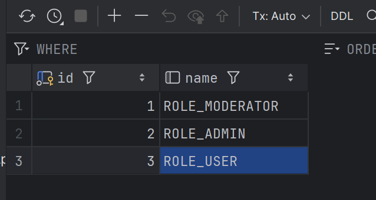

to start Frontend:
in Console:
  - cd in folder Frontend 
  - npm install
  - run : npm run dev

to use the database:
1. install docker desktop
2. install a mysql database in a docker container
3. add the credetiels and ports an the port in the compose.yml 
4. connect the database to the server
5. add the collums Role_User/Role_Admin/Role_Moderator to the role dataset

to start backend:
1. Start docker Container with the mysql database  
2. 2.Start Springboot

